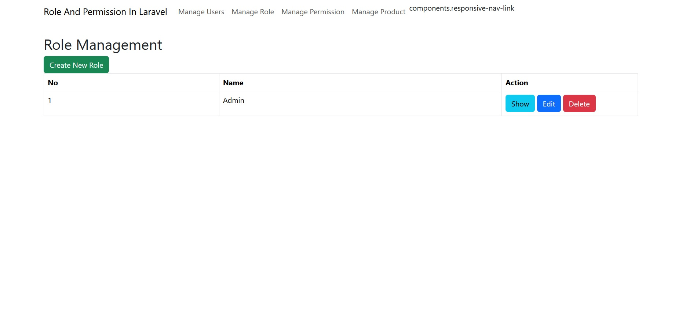
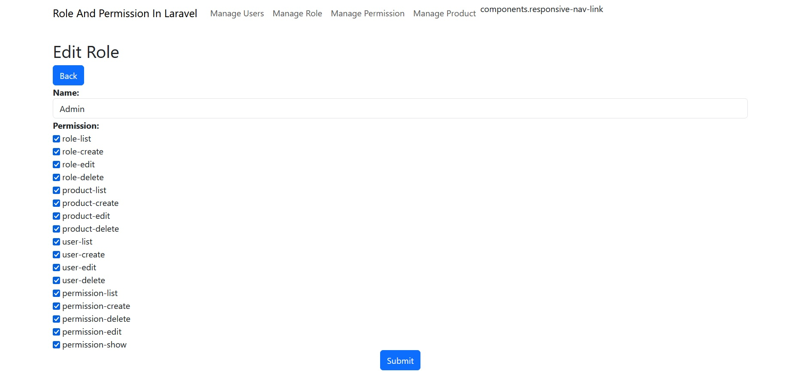

#note

-perhatikan file kernel.php

-php artisan vendor:publish --provider="Spatie\Permission\PermissionServiceProvider"

#instalasi

-cp .env.example menjadi env dan setting configuration database

-php artisan key:generate

-composer install / composer update

-php artisan migrate:fresh --seed

-php artisan serve
